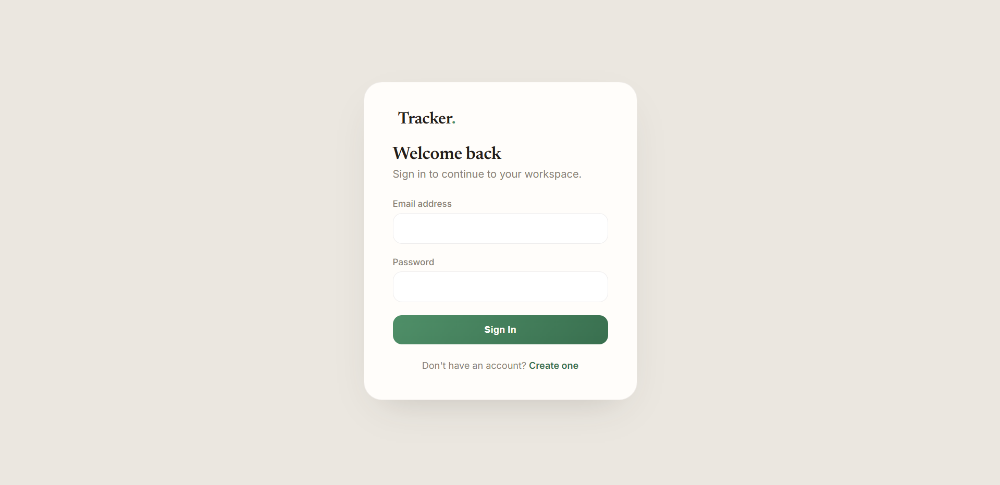

  # CERTII 
  
  **CERTIFICATION TRACKER// ANALYSIS // DASHBOARD //**

  

Tracks employee training completion, certification validity, and upcoming renewals across Employee, Manager, and Admin roles.

---

## Features & Recent Updates

**Employee Workspace**
* **Interactive Training:** Enroll in and unenroll from courses dynamically. Unenrolled users see a blurred, locked preview of the module quiz.
* **Assessments:** Built-in quizzes to test compliance and security knowledge. 
* **Dynamic Certificates:** Passing a quiz triggers a congratulatory modal with a generated Certificate of Completion that can be exported directly to PDF.
* **Dashboard Tracking:** Track expiring, valid, and expired certifications at a glance, with quick links to contact administration for renewals.

**Manager Workspace**
* **Team Analytics:** Real-time visual progress bars showing the team's overall completion rate and active enrollments.
* **Activity Feed:** Track the most recently issued team certifications directly from the dashboard.
* **Compliance Reporting:** Export team compliance statuses to CSV.

**Admin Workspace**
* **Course & Instructor Management:** Full CRUD capabilities for the training catalog. Safe-delete constraints ensure that deleting an instructor automatically unassigns them from active courses without breaking the database.
* **User Management:** Manage employee accounts, roles, and view individual training snapshots.
* **System Overview:** High-level metrics on total active enrollments, course offerings, and impending expirations.

**UI / UX**
* Modern, distraction-free layout with a fixed sidebar navigation and responsive mobile support.
* Clean visual hierarchy using custom badges, interactive modals, and subtle state transitions.

---

## Installation (Laragon)

1. Place the `certii` folder inside your Laragon `www` directory, e.g. `C:\laragon\www\certii`. If you already have another project in `www`, just make sure the folder name `certii` doesn't collide with it.
2. Open phpMyAdmin (or the Laragon MySQL terminal) and import `database/schema.sql`. This creates the `corporate_training_db` database, its tables, and the demo accounts below.
3. Start Apache and MySQL in Laragon.
4. Visit `http://localhost/certii/` or `http://certii.test` if Laragon's auto virtual hosts are enabled.

## Demo Accounts

Passwords are BCRYPT hashed in the database; the plaintext for all three is `password123`.

| Role | Email | Password |
| :--- | :--- | :--- |
| Administrator | `admin@example.com` | `password123` |
| Manager | `manager@example.com` | `password123` |
| Employee | `employee@example.com` | `password123` |

## Security Notes

- Every dashboard page is guarded by role before any output is rendered; users landing on a page outside their role are redirected to their own dashboard.
- All queries built from user input use PDO prepared statements to prevent SQL injection.
- Passwords are hashed with `password_hash()` and verified with `password_verify()`.
- Safe deletion routines prevent database foreign key errors when removing related data (e.g., instructors).
